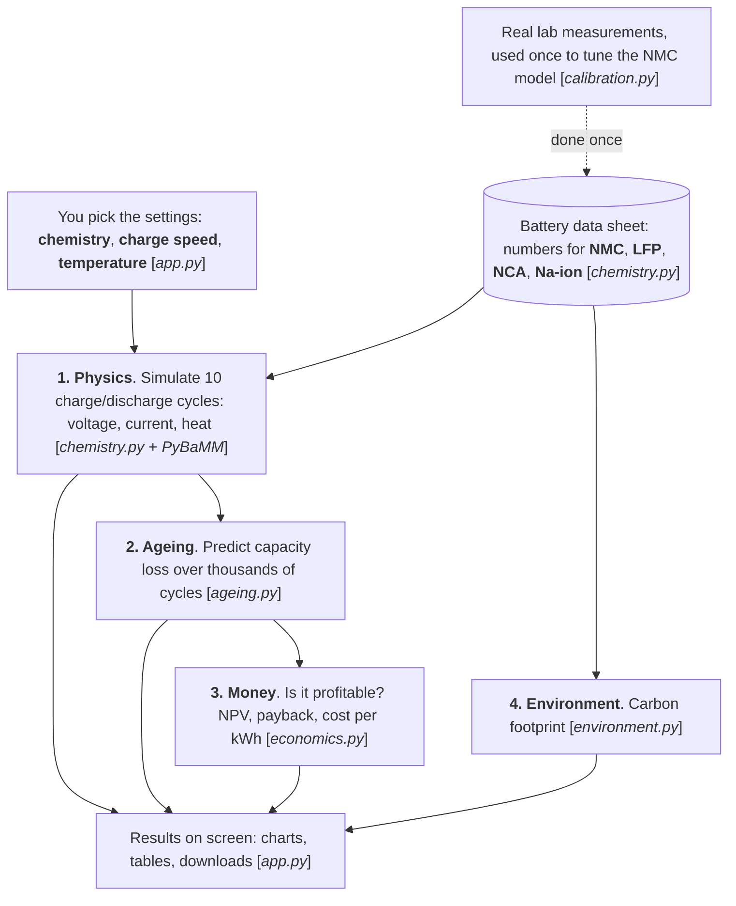

    
](https://battery-twin.streamlit.app/)
# Battery Digital Twin

A battery cell simulator that combines a **physics model** (PyBaMM) with **empirical ageing
models fitted to published measurements**, plus techno-economic (TEA) and life-cycle (LCA)
screening, in a Streamlit dashboard. Chemistries: NMC, LFP, NCA and sodium-ion.

## Quick start

```
git clone <this repository>
cd <repository folder>
python -m venv .venv
.venv\Scripts\activate            # Windows   (Linux/macOS: source .venv/bin/activate)
pip install -r requirements.txt
python -m streamlit run app.py    # dashboard
pytest -q                         # tests
```

## How it works

Follow the arrows from top to bottom. Each box is one step, with the file that does it in italics. The dashed arrow is a step done once, not on every run.



## Physics

PyBaMM solves the battery's equations for 10 full cycles. This is accurate but slow, so it only runs a few cycles. PyBaMM simulates full charge/discharge cycles: voltage,
   current, heat and state of charge (SPMe, or DFN above 2C charge).

## Ageing

Formulas fitted to real lab tests take those 10 cycles and project how much capacity is left after thousands more (up to 20,000 cycles). The simulated state-of-charge swing and cell temperature drive an empirical capacity-fade model for that chemistry. Each cycle is followed by a rest so that it lasts as long as in real use (set by "Cycles per year", 365 = once a day), because batteries also age while they sit idle (calendar ageing).

## Money and environment

The ageing curve tells the economics how much energy the battery delivers each year. The carbon footprint only needs the data sheet and pack size. The capacity curve feeds an arbitrage TEA (NPV, IRR, payback, LCOS, second life) cycle by cycle: when capacity drops below the retirement threshold (default 50 %, where the data ends) the battery stops earning and stops costing. A screening LCA gives CO2eq, water and ecotoxicity.

| Chemistry | Physics parameters | Ageing model and data |
|---|---|---|
| NMC | Chen 2020 (LG M50), calibrated to Kirkaldy et al. 2024 | NREL BLAST-Lite, LG M50 data (Truong Bui et al., IEEE 2021) |
| LFP | Prada 2013 (A123 26650) | NREL BLAST-Lite, Sony-Murata 3 Ah (Naumann et al. 2018, 2020; Gasper et al., JES 2022) |
| NCA | Kim 2011 (pouch) | NREL BLAST-Lite, Panasonic NCR18650B (Keil et al., JES 2016; Preger et al., JES 2020) |
| Na-ion | Chayambuka 2022 (hard carbon / NVPF) | 0.1 % per cycle (adjustable), commercial NVPF cell (Carter et al., Energies 18, 661, 2025) |

The BLAST-Lite models compute degradation rates from one simulated cycle; because the cycle
repeats, their capacity-loss trajectories are evaluated in closed form (matches BLAST-Lite's
own cycle-by-cycle stepping within 0.0004).

## Validation and known limitations

- **NMC physics** is calibrated to measured LG M50T data (Kirkaldy et al., J. Power Sources
  603, 2024, cycled at 70–85 % state of charge): lithium loss within 0.5 %-points at 28–41 °C;
  2.6 %-points too low at 16 °C (not used in the fit). `python scripts/validate.py`. The
  dashboard shows this comparison under "How accurate is this?".
- **NMC ageing model** was fitted to full-depth cycling. On the narrow 70–85 % window of the
  Kirkaldy data it over-predicts fade by 7–12 %-points, because its cycling term ignores depth
  of discharge. The dashboard always runs full cycles, which is within its fitted conditions.
- **NCA may be optimistic:** at one cycle a day and 20 °C the model gives about 2,000 cycles to 80 %, while
  Preger et al. report about 250–1,500 equivalent full cycles for these cells; the model does
  not capture their late, sudden capacity drop ("knee").
- **Sodium-ion** rests on about 100 measured cycles at C/3; longer runs are extrapolations. The
  0.1 %/cycle comes from the worst of the four commercial sodium-ion cells in Carter et al.; two
  others kept more than 99 % after 100 cycles (< 0.01 %/cycle), and the authors warn against
  generalising from four cells. At 0.1 %/cycle the battery is worn out within about two years of
  daily cycling, so its NPV is negative; the rate can be changed in the sidebar. No
  temperature dependence is applied (Klick et al., Batteries & Supercaps 2025, saw similar fade
  at 25 and 40 °C on another commercial sodium-ion cell). PyBaMM's sodium model is isothermal.
- **LFP** physics (A123) and ageing (Sony-Murata) come from different cells of the same chemistry.
- **Shaded range:** the capacity chart shows the result for a cell 5 °C cooler and 5 °C hotter
  (lithium) or for the best and worst measured commercial cells, 0.01–0.1 %/cycle (sodium-ion).
  It shows how sensitive the result is to that input, not a statistical confidence interval.
- All curves stop at 50 % capacity, where the data end. The dashboard warns whenever the
  temperature, charge/discharge rate or cycle count is outside the measured conditions. The
  default settings (20 °C, 0.3C charge, 1C discharge) are inside the data for NMC, LFP and NCA.
- **NCA** uses the Kim 2011 parameter set, a small pouch cell (about 1.7 Wh), so a pack needs
  many more cells than with the other chemistries.
- Costs, carbon, water and ecotoxicity factors are indicative assumptions, not sourced data.

## Repository layout

```
app.py                      Streamlit dashboard
src/battery_twin/
    chemistry.py            chemistry table, PyBaMM physics, battery test
    ageing.py               empirical ageing models and validity warnings
    economics.py            TEA        environment.py   LCA
    calibration.py          NMC physics calibration against Kirkaldy et al. 2024
    data/                   measured data (CC-BY-4.0) and calibration.json, read by chemistry.py
    _vendor/blast_lite/     subset of NREL BLAST-Lite (BSD-3-Clause), patched for NumPy 2
scripts/                    run_single, study_temperature, study_charge_rate,
                            export_csv, calibrate, validate (outputs go to ./results)
tests/                      pytest suite (physics, ageing, economics, dashboard)
```

## Development

This project was developed with AI assistance (Claude, by Anthropic). The AI wrote most of
the code and helped find and evaluate the published data and models it builds on. I defined
the goals and requirements, chose the direction at each step, ran and tested the code on my
own machine, reported problems and decided which results to keep.

## Licences and credits

Code: MIT (see `LICENSE`). Vendored BLAST-Lite: BSD-3-Clause, © Alliance for Energy
Innovation (NREL), see `src/battery_twin/_vendor/blast_lite/`. Kirkaldy et al. data:
CC-BY-4.0, https://doi.org/10.5281/zenodo.10637534. PyBaMM parameter sets are cited by
name in `chemistry.py`.
